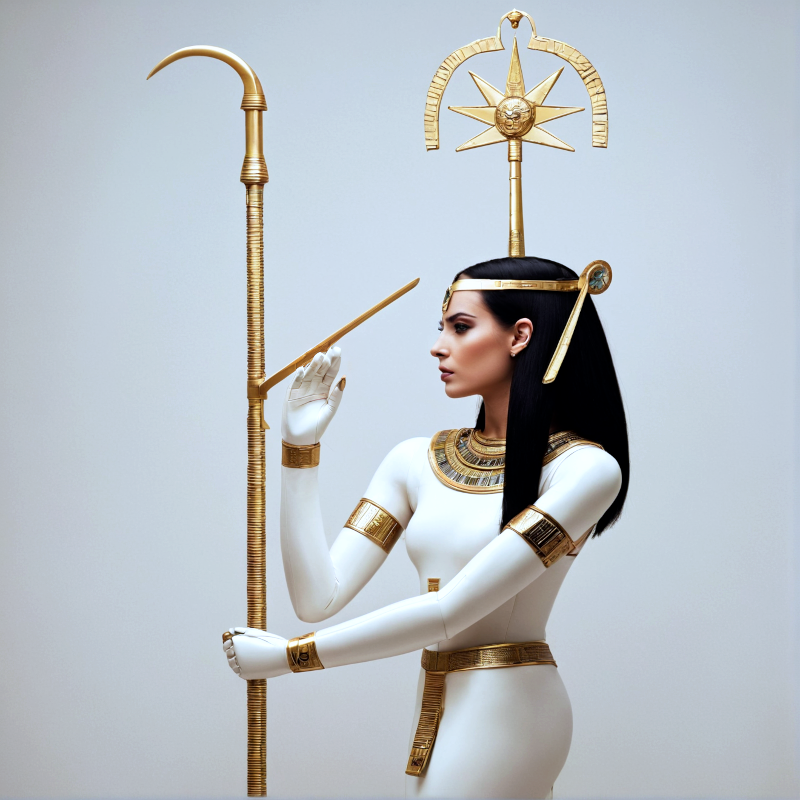

# Seshat AI

This is an extension for [text-generation-webui](https://github.com/oobabooga/text-generation-webui) named after the Egyptian Goddess for writing, wisdom, and knowledge. The extension is designed to write scientific text based true scientific publications (and with citations to these). For the best results, the right publications should be referenced in the query, as arxiv:0000.00000 or pmid:00000000. Alternatively, you can mark keywords in your query with curly brackets, and these will be used to search arXiv and/or PubMed. Finally, you can choose to have keywords be automatically detected in the query, but this is an experimental feature that often yields poor results. I get the best results using models based on Mixtral 8x7B, but I have also been getting good results with smaller models. My current preferred models for Seshat are Mixtral 8x7B and Nous Hermes 2 Mixtral 8x7B DPO. The former does the best job at following instructions on how to cited sources, whereas the latter avoids its tendency to overuse specific fancy "ChatGPT words".

To install this extension, clone the repository with the ``extensions`` folder of your text-generation-webui installation. This will create a new directory called Seshat. For the best results, I recommend that you move the files ``Seshat.png`` and ``Seshat.yaml`` from this directory into your ``characters`` directory and activate this character when using the extension. The character card contains important instructions to try to ensure that the LLM sticks to the provided references. These instructions could have been built into the extension itself, but are instead provided as a character card to make experimentation with the prompt.

